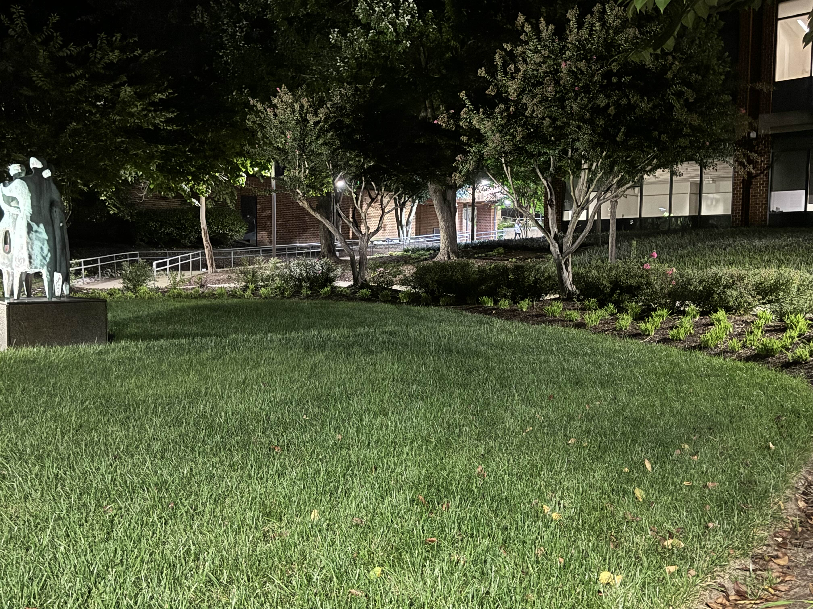

# Night School
*Category: OSINT*  
*CTF Rating: Easy*  
*Solves: 586*  

## Given:

"It's said that a famous geocacher has left a cache on our Fairfax campus. He took this picture before disappearing into the night. Could you help us find where this picture was taken?

The flag is pctf{NAME_OF_STATUE}"

Also included is a picture of a statue.

## Solution:

Looking at this right away I know I am looking for a statue on GMU's Fairfax campus. My first action was to go to google images and search "GMU fairfax campus statues", this however only gave me images on a single person statue, and looking at the given image it is clear we are looking for a statue with three figures. 

This lead me to my next search "GMU fairfax campus statue with 3 people". The first result in this search gave an image of a statue that looked similar to the one in the given image. I then went to the site where this image was from and on this page was a picture of said statue and its name, "Communitas", which was the flag.

  
[Link](https://www.gmu.edu/discover-mason)

## Conclusion:

Nothing to really say about this one, was pretty straightforward.

Flag: `pctf{COMMUNITAS}`

