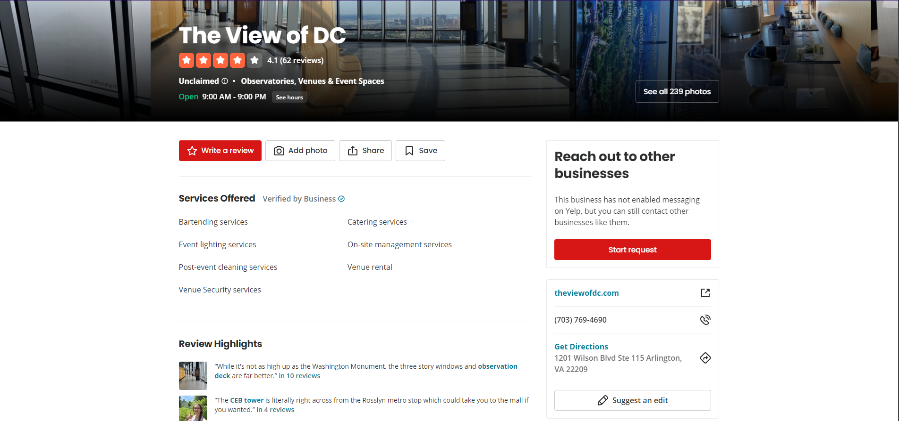
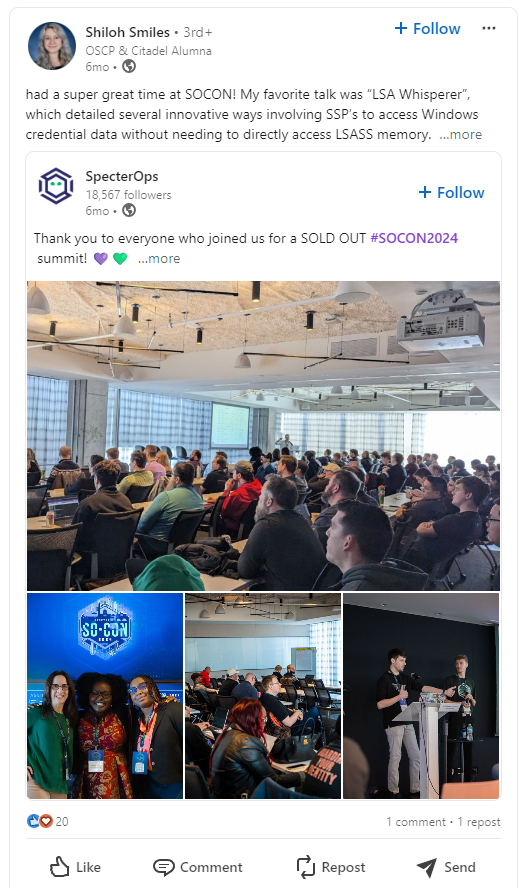
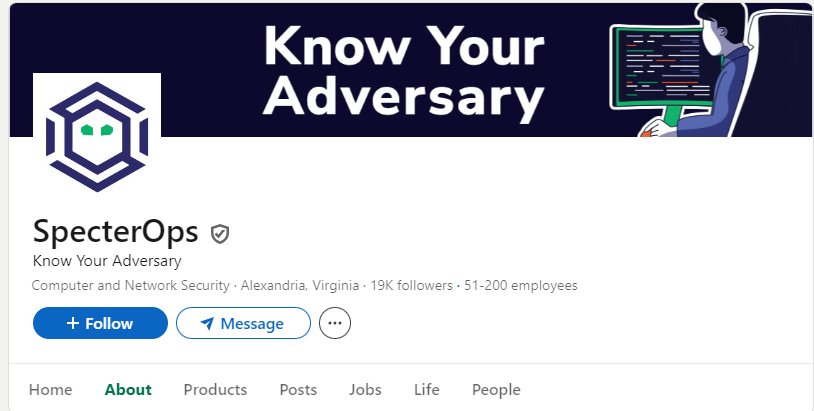
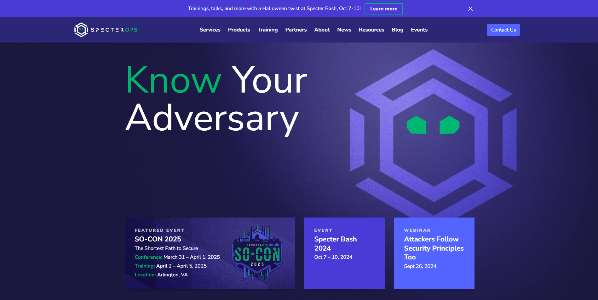
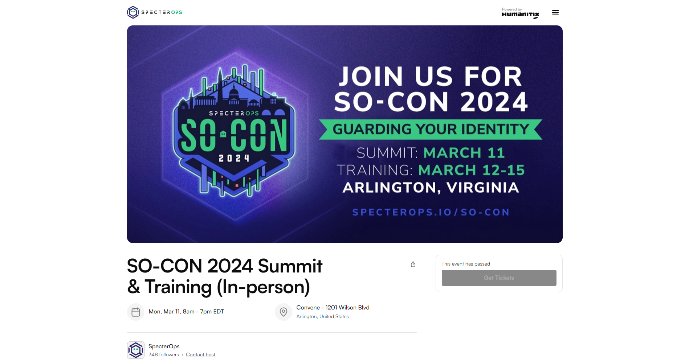

# On The Run
*Category: OSINT*  
*CTF Rating: Easy*  
*Solves: 595*  

## Given:

"We've been tracking the adversary for weeks, and he just slipped up and posted this gorgeous high-rise view on his Twitter. His caption was "awesome meeting with a gorgeous view!" Can you track down his location?

Flag format will be `PCTF{<business name of his location>}`. Not a street address. If he were in a WeWork space, it would be PCTF{wework}.**

Author: Shiloh Smiles (arcticx)"

Also included is this image taken from some elevated position.

## Solution:

The first thing I did was take this image and reverse image search it with google images. The third result was a yelp page for "THE VIEW OF DC." From here I got an address, `1201 Wilson Blvd Ste 115 Arlington, VA 22209`.

  
[Link](https://www.yelp.com/biz/the-view-of-dc-arlington)

#### Unintended Solve:
*I consider this an unintended solution because it required significantly more effort than what was really required.*

This is were I made the first my first mistake, instead of taking this address in its entirety and going to google maps and plugging it in, I instead opted to just take the city and find the roof of the white building on the left in the given picture instead. From here I looked for a sight line that would give me a similar view to the given image and then looked for all the buildings taller than the white building and considered each of those possibilities. This left me with two real options, the Nestle building located at `1812 N Moore St` and the building that the "THE VIEW OF DC" was located in, `1201 Wilson Blvd`.  After comparing the possible views and possible points from where the image was taken between the I initially believed that the image was taken from somewhere in the Nestle building. However, after attempting flags with a few of the different business names and not getting a solve, I turned to look for more information. 

This was where I made a second mistake, I should have just gone to the `1201 Wilson Blvd` building and started guessing flags with businesses in there, however I decided to take a slightly more winded approach. Instead I started looking into the challenge creator themselves, because I considering it more than possible that they may have taken the image themselves. A simple google search of the name `Shiloh Smiles` lead me to a LinkedIn page for the challenge author and saw in her posts for any event she might have physically attended in the last year or so. This lead me to a post about her attending a convention called `SOCON` which was put on by a company called `SpecterOps`.

  
*No link for this one*

My next step was looking at the SpecterOps LinkedIn page to see where they were located or if there was any information about where the convention was located. On their LinkedIn page it says that the company itself is based in `Alexandria, Virginia`, so I considered it quite possible that they would host an event in Arlington. From here I went to their website and confirmed that SO-CON was indeed hosted in Arlington.

  
[Link](https://www.linkedin.com/company/specterops/about/)

  
[Link](https://specterops.io/)

After confirming the general location, I began looking for an address for the convention space, and with a simple google search for `SpecterOps SO-CON 2024 conference location`, the the third result gave me a site with both an address and business name, `Convene - 1201 Wilson Blvd`. 

  
[Link](https://events.humanitix.com/so-con-2024-conference-in-person)

At this point I realized how much extra work I did.

#### More "Direct" Solve:
*What in reality probably would have taken significantly less time.*

What I should have done after determining the two possible buildings, and failing to get the solve with any business from the `1812 N Moore St` building was to have attempted the same thing with the `1201 Wilson Blvd` building, where I just submit flags with different names of businesses located in the building. 

## Conclusion:

After doing what I did for this challenge, I think it is important to remember sometimes "brute force" can be quicker, and not to completely forget the existence of the other building you had considered after failing with the first one.

Flag: `PCTF{convene}`

