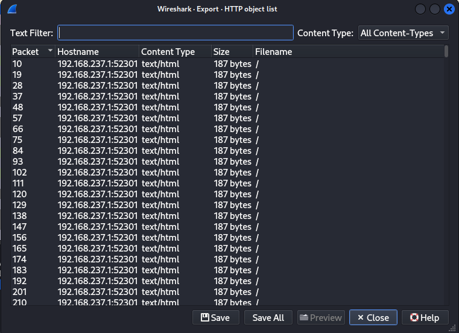
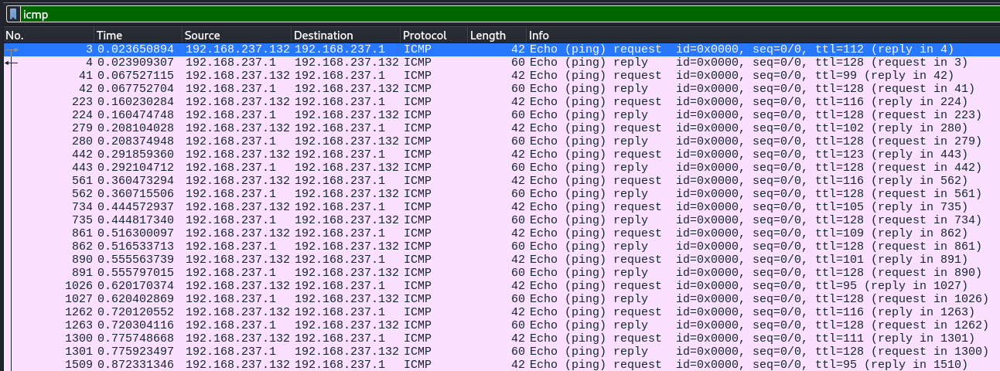

# Simple Extraction
*Category: Forensics*  
*CTF Rating: Easy*  
*Solves: 287*  

## Given:

 "We've got some reports about information being sent out of our network. Can you figure out what message was sent out."

Also included is a file a pcapng file.

## Solution:

To solve this challenge, Wireshark is all that is needed. The capture primarily consists of TCP streams, HTTP GET requests and responses, and ICMP pings and responses. 

Starting by giving the capture  just a quick scroll through, I  disregarded the ICMP packets and was more interested in the HTTP traffic. This would end up leading me to nothing but a waste of time.

After first looking at this, my first thought was to check the HTTP requests for anything of value. However after looking at the first few instances and then in the export http objects window, determined that there was nothing of any value there. 

I then moved to looking at the TCP streams and came to a similar conclusion.

Finally I looped back to the ICMP packets. First I applied a filter to only see packets of this type, nothing immediately jumped out at me. After looking at it for a few minutes I noticed a sort of pattern with the TTL values of the packets. All of the reply packets had a TTL of 128, however all of the request packets had varying TTL values.

After seeing this I copied down all of the TTL values for all of the response and got these values

`112 99 116 102 123 116 105 109 101 95 116 111 95 108 105 118 101 95 101 120 102 105 108 116 114 97 116 105 111 110 125`

After looking at this for admittedly longer than I should have, I realized that these were all between 0 and 127 so they fit the criteria for ASCII values. After converting them to the characters they represent, the flag was revealed. 

## Conclusion:

Don't initially right something off just because it doesn't seem like it would actually be part of the solution after a first glance. Also making a column for the TTL value in Wireshark could be useful in the future.

Flag: `pctf{time_to_live_exfiltration}`