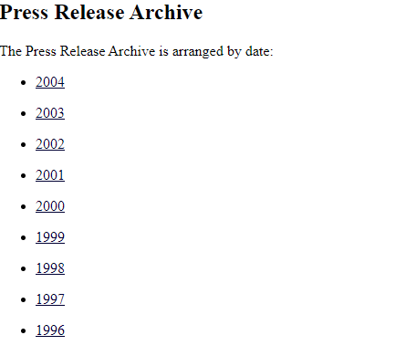

# Studious
*Category: OSINT*  
*CTF Rating: Medium*  
*Solves: 417*  

## Given:

"How much was tuition in for GWU graduate per credit hour for the 1998-1999 school year? Flag will be amount with just a period, like PCTF{1050.75} if it were $1,050.75.

NOTE: George Washington University, not George Mason University."

## Solution:

My first action was to just simply google the first sentence of the given prompt, "How much was tuition in for GWU graduate per credit hour for the 1998-1999 school year." The first result was to this a document with this information, but for the following school year.

  
[Link](https://www2.gwu.edu/~media/pressreleases/02_12_1999_tuition.html)

From here I just backtracked to the general press releases site which allowed me to choose releases by year.

  
[Link](https://www2.gwu.edu/~media/pressreleases/)

Because we were looking for the tuition per credit from 1998, I selected the year 1998 and was given a page with all of the press releases from that year. From here I scrolled down to February because that was when the one for the following year was posted. Lo and behold there was a release on the 13th titled "GW Announces Lowest Tuition/ Fee Increase In A Decade"

  
[Link](https://www2.gwu.edu/~media/pressreleases/1998.html)

Opening this release gives us an article similar to the one found in the initial google search, and after giving it a quick read, the sentence "Tuition and fees for on-campus graduate students will be $714.50 per credit hour and GW Law School tuition and fees will increase 4% to $23,955." gives me the answer I am looking for, and therefore the flag for the challenge.

  
[Link](https://www2.gwu.edu/~media/pressreleases/tuition.html)

## Conclusion:

Not really much to say here, was fun though.

Flag: `PCTF{714.50}`
