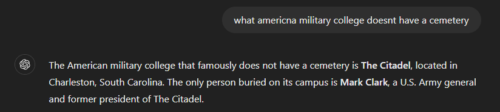

# sixfeetunder
*Category: OSINT*  
*CTF Rating: Easy*  
*Solves: 401*

## Given:

"There is an American military college that, famously, only has one person buried on its campus. What is the name of that person? Ignore any honorifics (such as Mr.), middle names, and spaces.

for example, Mr. John A. Smith would be PCTF{johnsmith}."

## Solution:
*Not my proudest solve.*

My first step was to do a google search for `american military college with only one person famously burried under it`, and didn't find anything useful, mostly just information about. So I turned to ChatGPT and gave it the prompt `There is an American military college that, famously, only has one person buried on its campus. What is the name of that person? Ignore any honorifics (such as Mr.), middle names, and spaces`. It was wrong 5 times before I asked it `what american military college doesn't have a cemetary`, this time it returned the right answer `The Citadel` and the name `Mark Clark`.

  
*No link*

## Conclusion:

Whilst this definitely was not my proudest solve considering AI did 99% of the leg work, the do say use all the tools availible to you.

Flag: `PCTF{markclark}`